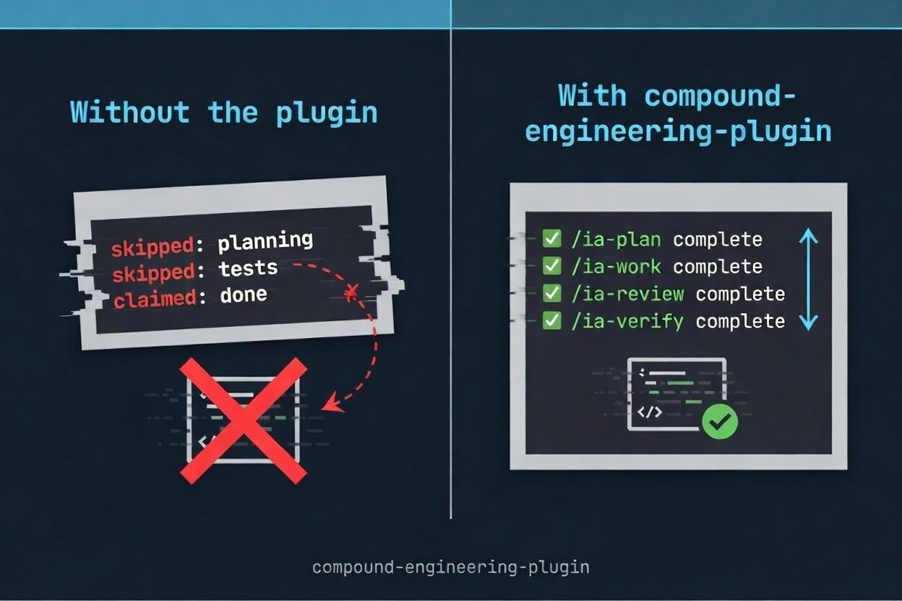

# Whetstone

[](https://code.claude.com/docs/en/plugins)
[](https://github.com/iliaal/whetstone/releases)
[](LICENSE)
[](https://x.com/intent/follow?screen_name=iliaa)


A Claude Code plugin that makes AI coding agents follow engineering discipline. Plan before coding. Verify before claiming done. Find root cause before patching. Review before merge. Skills activate based on file type and task signals, not manual toggling.

Bundles agents, skills, workflow commands, and a skill distillery for PHP, Python, TypeScript, React, and infrastructure workflows.

## Who this is for

**Teams using Claude Code for real work.** You're building with PHP, Python, TypeScript, or React. You want the agent to plan before building, verify before shipping, and debug by reasoning instead of guessing. This plugin provides that structure.

**Solo developers who want consistency.** Write a Bash script and the agent enforces `set -Eeuo pipefail` and ShellCheck compliance. Touch a Laravel controller and it applies strict types and thin-controller patterns. No setup, no toggling.

**Anyone building with AI agents.** Includes skills for multi-agent orchestration, agent-native architecture design, and a distillery that generates new skills from top-rated community sources.

## The Problem

AI coding agents skip planning, claim "done" without verifying, patch symptoms over root causes, and forget what they learned when context resets. The output looks polished. The behavior underneath is undisciplined.

The long-form argument is at [AI Agents Don't Lack Capability. They Lack Process.](https://ilia.ws/blog/ai-agents-dont-lack-capability-they-lack-process). This plugin enforces it.

## 🚀 Install

### Claude Code (recommended)

```bash
/plugin marketplace add https://github.com/iliaal/whetstone
/plugin install whetstone@iliaal-marketplace
/reload-plugins
```

### Standalone skills (any AI coding agent)

Individual skills work with Claude Code, Cursor, Codex, Gemini CLI, Copilot CLI, OpenCode, and [35+ other agents](https://agentskills.io) via the [ai-skills](https://github.com/iliaal/ai-skills) repo:

```bash
# All skills
npx skills add iliaal/ai-skills

# Single skill
npx skills add iliaal/ai-skills -s code-review

# Target a specific agent
npx skills add iliaal/ai-skills -a cursor
```

### Codex

Codex's native plugin spec does not yet register custom agents, so we ship a Bun/TypeScript converter that generates Codex-native output from the Claude plugin source. Prerequisites: a local clone and `bun` installed.

```bash
git clone https://github.com/iliaal/whetstone
cd whetstone
bun install
bun run src/index.ts install ./plugins/whetstone --to codex
```

By default the converter writes Codex skills and agents under `~/.codex/`. Override with `--codex-home ~/path/to/.codex` to target a non-default Codex install. Once native Codex plugin support for agents lands, this conversion step goes away.

Before re-installing (or switching away from this plugin), back up stale artifacts:

```bash
bun run src/index.ts cleanup --target codex              # moves ~/.codex/skills and ~/.codex/prompts to a timestamped backup
bun run src/index.ts cleanup --target codex --dry-run    # preview only
```

Backups land under `~/.cache/whetstone/legacy-backup/`.

### OpenCode

Same converter, different target. OpenCode reads skills from its per-project config. The converter translates the plugin's `SKILL.md` format into OpenCode's expected shape and writes output into the current project (override with `--output <dir>`).

```bash
bun run src/index.ts install ./plugins/whetstone --to opencode
```

Pass `--also codex` to generate both Codex and OpenCode outputs in one invocation.

Cleanup for OpenCode (and other targets) uses the same command:

```bash
bun run src/index.ts cleanup --target opencode
bun run src/index.ts cleanup --target kilocode
bun run src/index.ts cleanup --target agents
```

### Additional targets (symlink-based)

For tools that read skills directly from `~/.agents/skills`, `~/.codex/skills`, or `~/.kilocode/skills`, `scripts/sync-to-tools.sh` symlinks the plugin's skill directory into each path so edits land immediately without re-conversion. Intended for active development, not production installs.

```bash
bash scripts/sync-to-tools.sh              # symlink into all three tool dirs
bash scripts/sync-to-tools.sh --dry-run    # preview changes
```

## 🔗 Works well with

- **[codesage](https://github.com/iliaal/codesage)** adds structural code intelligence (find symbols, references, dependencies, blast-radius analysis) as an MCP server. The plugin enforces discipline; codesage gives the agent the map of the codebase to apply that discipline against.
- **[ai-skills](https://github.com/iliaal/ai-skills)** is the read-only mirror of this plugin's skills, packaged for non-Claude-Code agents. Use the plugin if you're on Claude Code; use the mirror if you're on Cursor, Codex, Gemini CLI, or similar.

## 🛠️ The workflow

Five commands form a loop: explore the problem, plan the solution, build it, review it, document what you learned. Each pass makes the next one faster because solutions accumulate as searchable docs.

| Command | What it does |
|---------|-------------|
| `/ia-brainstorm` | Interviews you one question at a time to surface hidden requirements. Produces 2-3 named approaches with trade-offs. No code until a design doc is approved. |
| `/ia-plan` | Turns a brainstorm or feature idea into a file-based plan with atomic tasks, specific file paths, and phased delivery in vertical slices. |
| `/ia-work` | Executes a plan with task tracking, worktree isolation, and verification gates. Each task runs through build/test before marking complete. |
| `/ia-review` | Multi-agent code review: scope-drift detection, spec compliance, code quality, security, performance. Auto-escalates to deep mode on complex diffs. |
| `/ia-compound` | Captures what you just solved as searchable documentation in `docs/solutions/` so the next person (or the agent) doesn't re-debug it. |

You don't have to use all five. `/ia-review` on its own is a solid pre-merge check. `/ia-plan` works standalone for scoping. Mix and match.



## ✨ Skills

Skills are instructions that activate based on what you're working on. They shape how the agent behaves, enforcing procedures and anti-patterns rather than adding knowledge.

### Architecture & design

| Skill | Description |
|-------|------------|
| [ia-agent-native-architecture](plugins/whetstone/skills/ia-agent-native-architecture/SKILL.md) | 15-area architecture checklist for systems where AI agents are primary actors: tool design, execution patterns, context injection, approval gates, audit trails. For designing agent systems or MCP tools. |
| [ia-frontend-design](plugins/whetstone/skills/ia-frontend-design/SKILL.md) | Requires a design philosophy statement before code, detects existing design systems to match, and bans AI design cliches (purple-to-blue gradients, Space Grotesk, three-card hero layouts). Calibrates output via variance, motion, and density parameters. For work where visual identity matters. |
| [ia-simplifying-code](plugins/whetstone/skills/ia-simplifying-code/SKILL.md) | Declutters code without changing behavior. Targets AI slop: redundant comments, unnecessary defensive checks, over-abstraction, verbose stdlib reimplementations. Applies changes in priority order and stops before touching public APIs. For cleanup after AI generation or accumulated complexity. |

### Language & framework

| Skill | Description |
|-------|------------|
| [ia-react-frontend](plugins/whetstone/skills/ia-react-frontend/SKILL.md) | Decision tree routing most "should I use an effect?" questions to non-effect solutions. Separates state tools by purpose (Zustand for client, React Query for server, nuqs for URL). Enforces React 19 patterns, App Router server/client boundaries, and flags that Server Actions are public endpoints. For React, Next.js, and Vitest/RTL testing. |
| [ia-nodejs-backend](plugins/whetstone/skills/ia-nodejs-backend/SKILL.md) | Strict layered architecture (routes > services > repos) with no cross-layer HTTP imports. Contract-first API design using Zod schemas as the single source of truth. Production patterns like circuit breaker and load shedding as requirements, not suggestions. For Express, Fastify, Hono, or NestJS backends. |
| [ia-python-services](plugins/whetstone/skills/ia-python-services/SKILL.md) | Mandates modern tooling (uv, ruff, ty) over legacy equivalents. Structured concurrency via `asyncio.TaskGroup`, idempotent background jobs, and structured JSON logging with correlation IDs via `contextvars`. For Python CLI tools, FastAPI services, async workers, or new project setup. |
| [ia-php-laravel](plugins/whetstone/skills/ia-php-laravel/SKILL.md) | `declare(strict_types=1)` everywhere, PHPStan level 8+, fat models / thin controllers, Form Requests with `toDto()`, event-driven side effects. Prevents N+1 by disabling lazy loading in dev. Defaults to feature tests through the full HTTP stack. For Laravel codebases. |
| [ia-rust-systems](plugins/whetstone/skills/ia-rust-systems/SKILL.md) | Edition 2024, workspace layout with inward-only deps, `thiserror` in libraries / `anyhow` in binaries, no `unwrap`/`expect` outside `main` and tests, every `unsafe` block needs a `// SAFETY:` comment. Tokio patterns (JoinSet, CancellationToken, bounded mpsc) and axum service layout. For Rust CLIs, axum services, or cargo workspaces. |
| [ia-pinescript](plugins/whetstone/skills/ia-pinescript/SKILL.md) | Prevents silent TradingView errors (ternary formatting, `plot()` scope restrictions), enforces `barstate.isconfirmed` to avoid repainting, requires walk-forward validation over pure backtesting. Flags indicator stacking and overfitted parameters. For Pine Script v6. |
| [ia-tailwind-css](plugins/whetstone/skills/ia-tailwind-css/SKILL.md) | Enforces v4's CSS-first config model (`@theme`, `@utility`, `@custom-variant` directives). Provides a v3-to-v4 breaking changes table. Prohibits dynamic class construction, mandates `gap` over `space-x`, `size-*` over paired `w-*/h-*`. For Tailwind v4 or v3 migrations. |

### Infrastructure

| Skill | Description |
|-------|------------|
| [ia-postgresql](plugins/whetstone/skills/ia-postgresql/SKILL.md) | BIGINT GENERATED ALWAYS AS IDENTITY over SERIAL, TIMESTAMPTZ over TIMESTAMP, indexes on every FK (Postgres doesn't auto-create them). Includes an unindexed FK detection query and mandates `EXPLAIN (ANALYZE, BUFFERS)` before any optimization claim. For schema design, query tuning, RLS, or partitioning. |
| [ia-terraform](plugins/whetstone/skills/ia-terraform/SKILL.md) | Specific file organization, `for_each` over `count` to prevent recreation on reordering, remote state with locking, `moved` blocks for renames, and four-tier testing (validate > tflint > plan tests > integration). For Terraform or OpenTofu. |
| [ia-linux-bash-scripting](plugins/whetstone/skills/ia-linux-bash-scripting/SKILL.md) | `set -Eeuo pipefail` as foundation, EXIT traps for cleanup, `printf` over `echo`, arrays over eval, `local` separated from assignment. Production templates for atomic writes, retry with backoff, and script locking. For any Bash script meant for production. |

### Testing & quality

| Skill | Description |
|-------|------------|
| [ia-writing-tests](plugins/whetstone/skills/ia-writing-tests/SKILL.md) | DAMP over DRY, test cases from user journeys not implementation details, real objects over mocks (mocks only at system boundaries). Requires red-green cycles for bug fix tests. Includes a 13-excuse Rationalization Table for when you're tempted to skip tests. Works with any language. |
| [ia-code-review](plugins/whetstone/skills/ia-code-review/SKILL.md) | Two-pass review: spec compliance first, then code quality. Every finding gets a confidence score and lands in auto-fix or ask-human buckets. Auto-escalates to multi-agent deep review when 3+ complexity signals appear. Checks scope drift against the PR's stated intent. For PR reviews and code audits. |
| [ia-receiving-code-review](plugins/whetstone/skills/ia-receiving-code-review/SKILL.md) | Verify-before-implement for every comment. Different skepticism levels by source: maximum for automated agents, trusted-but-verified for project owners. Requires evidence when pushing back. Prohibits performative agreement. For processing review feedback on your code. |
| [ia-debugging](plugins/whetstone/skills/ia-debugging/SKILL.md) | The Iron Law: no fix until root cause is identified with `file:line` evidence two levels deep. Reproduction before investigation, one-change-at-a-time hypothesis testing, failing test before the fix. Escalates after 3 failed attempts instead of continuing to guess. |
| [ia-verification-before-completion](plugins/whetstone/skills/ia-verification-before-completion/SKILL.md) | Five-step gate before any "done" claim: Identify, Run, Read, Verify, Claim. No reusing prior results. Catches "zero issues on first pass" as a red flag. Usually activates from other skills. |
| [ia-planning](plugins/whetstone/skills/ia-planning/SKILL.md) | Three ceremony levels: full `.plan/` directory for multi-file work, inline checklist for 3-5 files, skip for single-file edits. Tasks must be verb-first, atomic, and name specific file paths. Phases capped at 5-8 files in vertical slices. Apply proactively before non-trivial coding. |

### Content & workflow

| Skill | Description |
|-------|------------|
| [ia-brainstorming](plugins/whetstone/skills/ia-brainstorming/SKILL.md) | Hard gate: no code until a design doc is approved. Reads the codebase first, interviews one question at a time, proposes 2-3 named approaches with trade-offs, saves a structured doc to `docs/brainstorms/`. For vague requirements or multiple valid interpretations. |
| [ia-compound-docs](plugins/whetstone/skills/ia-compound-docs/SKILL.md) | Auto-triggers after "that worked" to capture solutions before context is lost. Validates frontmatter, checks for duplicates, detects recurring patterns when 3+ similar issues appear. For post-debugging documentation that builds searchable institutional knowledge. |
| [ia-document-review](plugins/whetstone/skills/ia-document-review/SKILL.md) | Activates specialized lenses (Product, Design, Security, Scope Guardian, Adversarial) based on document signals. Scores on four criteria, identifies one critical improvement, and can dispatch a fresh-eyes sub-agent. For polishing specs or brainstorms before handing them to planning. |
| [ia-writing](plugins/whetstone/skills/ia-writing/SKILL.md) | Kill-on-sight list of AI vocabulary (delve, crucial, leverage, robust...) and structural tells (forced triads, sycophantic openers). Five-dimension scoring rubric; anything below 35/50 gets revised. For prose: blog posts, PR descriptions, docs, changelogs. |
| [ia-git-worktree](plugins/whetstone/skills/ia-git-worktree/SKILL.md) | Routes all operations through a manager script handling `.env` copying, `.gitignore` updates, and dependency installation. Detects execution context and adapts. For parallel feature development or isolated reviews. |
| [ia-md-docs](plugins/whetstone/skills/ia-md-docs/SKILL.md) | Treats AGENTS.md as the canonical context file. Verifies every factual claim against the actual codebase before writing. For project documentation that's stale, missing, or needs initialization. |
| [ia-file-todos](plugins/whetstone/skills/ia-file-todos/SKILL.md) | File-based task tracking with structured YAML frontmatter and naming conventions. Distinct from in-session memory and application-level models. For persistent, human-and-agent-readable todo files with dependency tracking. |

### AI & prompting

| Skill | Description |
|-------|------------|
| [ia-meta-prompting](plugins/whetstone/skills/ia-meta-prompting/SKILL.md) | Reasoning patterns via slash commands: `/ia-verify` adds challenge-and-verify, `/adversarial` generates ranked counterarguments, `/edge` enumerates break scenarios, `/confidence` assigns per-claim scores. Some auto-trigger in context. For stress-testing decisions or surfacing hidden assumptions. |
| [ia-refine-prompt](plugins/whetstone/skills/ia-refine-prompt/SKILL.md) | Assesses against a six-element checklist (task, constraints, format, context, examples, edge cases), rewrites in specification language, validates all gaps addressed. Enforces 0.75x-1.5x length ratio and won't invent missing info. For prompts that produce inconsistent results. |
| [ia-reflect](plugins/whetstone/skills/ia-reflect/SKILL.md) | Scans the full conversation for mistakes, friction, and wins, citing specific exchanges. Proposes ranked improvements and audits skills used in the session for token efficiency. For end-of-session lessons learned. |

### Multi-agent orchestration

| Skill | Description |
|-------|------------|
| [ia-orchestrating-swarms](plugins/whetstone/skills/ia-orchestrating-swarms/SKILL.md) | Distinguishes short-lived subagents from persistent teammates, prescribes when to use each, and enforces dispatch discipline: worktree isolation for parallel implementation, direct context over delegated navigation, fresh agents for failed tasks. Four standardized status signals. For tasks large enough to benefit from parallelism. |

## 🤖 Agents

Specialized subagents dispatched by the main agent or by workflow commands. Each runs in isolation with its own tools and context.

### Review

| Agent | Description |
|-------|------------|
| [ia-accessibility-tester](plugins/whetstone/agents/ia-accessibility-tester.md) | WCAG 2.1 audit across keyboard navigation, screen reader compatibility, contrast ratios, ARIA attributes, and form accessibility. For compliance checks before launch. |
| [ia-architecture-strategist](plugins/whetstone/agents/ia-architecture-strategist.md) | Evaluates architectural soundness, design pattern compliance, and structural consistency. For service additions, refactors, or codebase pattern audits. |
| [ia-cloud-architect](plugins/whetstone/agents/ia-cloud-architect.md) | Analyzes infrastructure against Well-Architected Framework principles: cost optimization, scalability, disaster recovery across AWS, Azure, and GCP. |
| [ia-code-simplicity-reviewer](plugins/whetstone/agents/ia-code-simplicity-reviewer.md) | Produces a simplification report (no code changes) identifying YAGNI violations and over-engineering. For post-implementation analysis. |
| [ia-database-guardian](plugins/whetstone/agents/ia-database-guardian.md) | Validates migration safety, referential constraints, and data integrity. For PRs touching migrations, backfills, or data transformations. |
| [ia-kieran-reviewer](plugins/whetstone/agents/ia-kieran-reviewer.md) | Opinionated Python and TypeScript review with a high bar for type safety, naming clarity, and modern patterns. |
| [ia-performance-oracle](plugins/whetstone/agents/ia-performance-oracle.md) | Identifies bottlenecks in algorithmic complexity, database queries, memory usage, and scalability limits. |
| [ia-security-sentinel](plugins/whetstone/agents/ia-security-sentinel.md) | Threat modeling and vulnerability scanning across authentication, input validation, secrets management, and OWASP categories. |
| [ia-spec-flow-analyzer](plugins/whetstone/agents/ia-spec-flow-analyzer.md) | Maps user flows through specifications to surface edge cases, missing clarifications, and completeness gaps before implementation. |

### Research

| Agent | Description |
|-------|------------|
| [ia-best-practices-researcher](plugins/whetstone/agents/ia-best-practices-researcher.md) | Gathers official framework docs, version-specific best practices, and industry standards for any technology. |
| [ia-git-history-analyzer](plugins/whetstone/agents/ia-git-history-analyzer.md) | Excavates git history to explain code evolution: traces commits, authors, and context around decisions. |
| [ia-learnings-researcher](plugins/whetstone/agents/ia-learnings-researcher.md) | Mines `docs/solutions/` for documented solutions and patterns relevant to the current task. Prevents repeating past mistakes. |
| [ia-repo-research-analyst](plugins/whetstone/agents/ia-repo-research-analyst.md) | Analyzes repository architecture, naming conventions, and implementation patterns. For onboarding or understanding project conventions. |

### Design

| Agent | Description |
|-------|------------|
| [ia-design-iterator](plugins/whetstone/agents/ia-design-iterator.md) | Iterative UI refinement through screenshot-analyze-improve cycles. For when initial design changes produce mediocre results. |
| [ia-figma-design-sync](plugins/whetstone/agents/ia-figma-design-sync.md) | Compares implemented UI against Figma designs, reports discrepancies, and optionally applies fixes. |

### Workflow

| Agent | Description |
|-------|------------|
| [ia-bug-reproduction-validator](plugins/whetstone/agents/ia-bug-reproduction-validator.md) | Reproduces bug reports and identifies root causes without applying fixes. Validates whether reports are genuine bugs before engineers invest. |
| [ia-deployment-verification-agent](plugins/whetstone/agents/ia-deployment-verification-agent.md) | Generates Go/No-Go deployment runbooks with SQL verification queries, rollback procedures, and monitoring plans for high-risk changes. Runs after database-guardian validates migration code. |
| [ia-infrastructure-engineer](plugins/whetstone/agents/ia-infrastructure-engineer.md) | Full deployment-lifecycle coverage: CI/CD pipelines (blue-green, canary, rolling, feature flags), Docker and containerization, observability stacks (metrics/logs/traces), and incident management. Not for DB migration verification (use deployment-verification-agent). |
| [ia-pr-comment-resolver](plugins/whetstone/agents/ia-pr-comment-resolver.md) | Implements a single pre-triaged PR comment where the action is already agreed on. For mechanical fixes, not judgment calls. |

## ⚡ Commands

All commands carry the `ia-` prefix to avoid collisions with Claude Code built-ins and sibling plugins. The full list:

### Workflow commands

| Command | Description |
|---------|------------|
| `/ia-brainstorm` | Explore requirements and approaches through one-at-a-time interviews before planning. |
| `/ia-plan` | Turn feature ideas into file-based implementation plans with atomic tasks and vertical slices. |
| `/ia-work` | Execute plans with task tracking, worktree isolation, and verification gates. |
| `/ia-review` | Multi-agent code review: scope-drift detection, spec compliance, code quality, security, performance. |
| `/ia-compound` | Capture solved problems as searchable documentation in `docs/solutions/`. |
| `/ia-document-release` | Post-ship documentation sync across README, ARCHITECTURE, CONTRIBUTING, and CHANGELOG. |

### Utility commands

| Command | Description |
|---------|------------|
| `/ia-lfg` | Full autonomous workflow: plan, build, review, ship. Use `--swarm` for parallel execution. |
| `/ia-verify` | Pre-PR verification pipeline: build, types, lint, tests, security scan, diff review. |
| `/ia-resolve-pr` | Batch-resolve PR review comments via cluster analysis and parallel agents. |
| `/ia-deepen-plan` | Enhance an existing plan with parallel research agents for each section. |
| `/ia-ideate` | Generate ranked improvement ideas by scanning the codebase, then divergent ideation and adversarial critique. |
| `/ia-setup` | Auto-detect project stack and configure which review agents run. |
| `/ia-adr` | Create Architecture Decision Records with format selection and lifecycle management. |
| `/ia-test-browser` | Run browser tests on pages affected by the current PR or branch. |
| `/ia-feature-video` | Record a video walkthrough of a feature and add it to the PR description. |
| `/ia-compound-refresh` | Review `docs/solutions/` for stale learnings: keep, update, replace, or archive. |
| `/ia-changelog` | Build changelogs from recent merges. |
| `/ia-reproduce-bug` | Reproduce bugs using logs and console output. |
| `/ia-report-bug` | Report a bug in the plugin. |
| `/ia-triage` | Triage and prioritize issues. |
| `/ia-resolve-todo-parallel` | Resolve all pending todos from the `todos/` directory in parallel. |
| `/ia-agent-native-audit` | Run agent-native architecture review with scored principles. |

## Design

Skills eat context. Every token a skill spends is one the agent can't use on your code. So these are built tight:

- **Under 1K tokens, 2K hard cap.** Overflow goes to `references/` files loaded on demand.
- **Front-loaded.** Critical rules first. Model attention drops off, so the important stuff leads.
- **Actions, not explanations.** Tell the agent what to do, not what things are. Skip anything the model already knows.
- **Every "don't" has a "do instead."** Bare prohibitions leave the agent guessing. Alternatives give it a clear path.
- **Keyword-rich descriptions.** The description is the only part loaded at startup across all installed skills. The agent uses it to decide whether to activate a skill, so it's packed with the exact phrases developers type. The body only loads when triggered.

## Skill distillery

The `distillery/` directory is a pipeline for generating, evaluating, and evolving skills. It fetches top-rated community skills, analyzes overlapping advice, strips filler, resolves contradictions, and synthesizes one focused instruction set per topic.

Beyond generation, the distillery mines Claude Code session logs to build evaluation datasets, scores skill effectiveness via LLM-as-judge, and evolves skills through DSPy optimization. Skills that pass evaluation get promoted to the plugin.

```bash
python3 distillery/scripts/distiller.py search "react"     # Find source skills
python3 distillery/scripts/distiller.py harvest-sessions    # Mine session logs for eval data
python3 distillery/scripts/distiller.py dspy-eval <skill>   # Score via LLM-as-judge
python3 distillery/scripts/distiller.py evolve <skill>      # Optimize via DSPy
python3 distillery/scripts/distiller.py test-triggers       # Regression test trigger patterns
```

## Repository structure

```
whetstone/
├── plugins/whetstone/   # The plugin
│   ├── agents/                     # 19 specialized subagents
│   ├── commands/                   # 22 slash commands
│   ├── skills/                     # 30 skills
│   ├── hooks/                      # Skill injection into subagents
│   └── README.md                   # Full component reference
├── distillery/                     # Skill generation, eval, and evolution
│   ├── scripts/                    # distiller.py + tests
│   └── generated-skills/           # Generated skill output
├── scripts/                        # Repo maintenance
└── src/                            # Bun/TS CLI for OpenCode/Codex conversion
```

## Acknowledgements

Two projects informed the shape of this plugin. Worth reading their sources directly if you're building something similar.

- **[EveryInc/compound-engineering-plugin](https://github.com/EveryInc/compound-engineering-plugin)**: the original "compound engineering" framing (each unit of engineering work should make the next one easier), the brainstorm > plan > work > review > compound loop, and the multi-target install model for Codex / OpenCode / Copilot / Gemini / Kiro / Pi.
- **[ComposioHQ/awesome-claude-skills](https://github.com/ComposioHQ/awesome-claude-skills)**: curated catalog of Claude skills the distillery mines for source material, alongside skills.sh.

## License

MIT

---

[Follow @iliaa on X](https://x.com/iliaa) • [Blog](https://ilia.ws) • If this improved your AI workflow, ⭐ star it!
